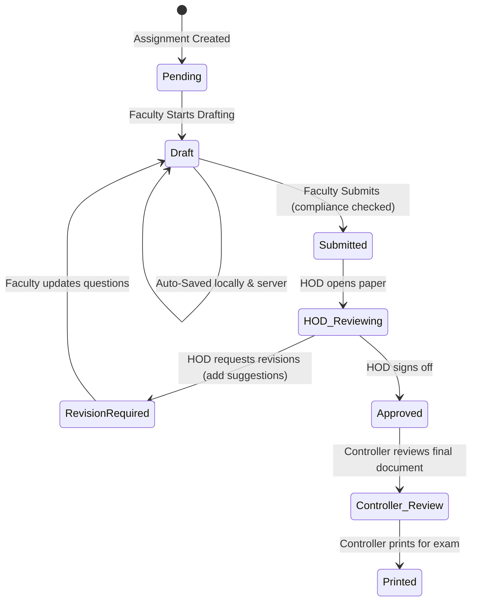

# AMCEC QPSet: Technical & Security Architectural Improvement Roadmap
**Author:** Principal Software Architect (15+ Years Experience in Enterprise Systems & Security)  
**Target Project:** AMCEC Question Paper Setting & Management Software  
**Status:** Review Draft  

---

## Executive Summary

After a deep architectural audit of the **AMCEC QPSet** codebase (both React frontend and Express/PostgreSQL backend), I have identified critical security vulnerabilities, architectural gaps, and workflow limitations that must be addressed before the platform can transition from a working prototype to a secure, compliant, and production-grade academic system.

The most pressing concerns lie in **Broken Access Control (OWASP Top 10 A01:2021)**, **Incomplete Frontend Integration (mocked paper creation)**, and the **absence of encryption for high-stakes exam assets**. 

This document maps out a comprehensive improvement roadmap divided into five key pillars:
1. **Security & Cryptographic Hardening (Top Priority)**
2. **Backend Architecture & API Completeness**
3. **Frontend Integration & Resilient UX**
4. **Academic Workflow & Blueprint Engine**
5. **DevOps, CI/CD, and Observability**

---

## 1. Security & Cryptographic Hardening (Top Priority)

### 1.1 Insecure Direct Object References (IDOR) Mitigation
*   **Vulnerability:** Endpoints such as `PATCH /api/v1/assignments/:id`, `PUT /api/v1/assignments/:id/paper`, and `POST /api/v1/assignments/:id/suggestions` perform role-based checks (e.g., `requireRole("qpsetter")`) but do not verify **resource ownership**. Any faculty member can modify or overwrite any other faculty's question paper by guessing or brute-forcing the assignment ID.
*   **Architectural Fix:** Implement scoped authorization middleware. The database must check the association before proceeding:
    ```typescript
    // Example Authorization Guard
    export function requireAssignmentOwnership() {
      return async (req: Request, _res: Response, next: NextFunction) => {
        const userId = req.user!.sub;
        const role = req.user!.role;
        const assignmentId = Number(req.params.id);

        const assignment = await prisma.assignment.findUnique({
          where: { id: assignmentId }
        });

        if (!assignment) {
          throw new ApiError(404, "Assignment not found");
        }

        if (role === Role.qpsetter && assignment.facultyId !== userId) {
          throw new ApiError(403, "Access Denied: You are not assigned to this paper");
        }

        if (role === Role.hod && assignment.hodId !== userId) {
          // Verify department alignment if multiple HODs exist
          throw new ApiError(403, "Access Denied: This assignment belongs to another department");
        }

        next();
      };
    }
    ```

### 1.2 User Management & Privilege Escalation Guard
*   **Vulnerability:** In `users.routes.ts`, any HOD has the authority to update or delete any user on the system, including other HODs or the Exam Controller.
*   **Architectural Fix:** Enforce a hierarchical user management scope:
    *   **Exam Controller:** Global scope (can manage HODs and all faculty).
    *   **HOD:** Departmental scope (can only manage users where `user.hodId === req.user.sub` or `user.dept === req.user.dept` and `user.role === Role.qpsetter`). HODs must be blocked from altering Controller accounts or HOD accounts.

### 1.3 Secure Storage for Examination Papers (Encryption-at-Rest)
*   **Vulnerability:** The `QuestionPaper` table stores exam contents as a raw, readable JSON blob. If the PostgreSQL database backups are leaked, or if a DBA has read access, all exam questions are exposed in plaintext.
*   **Architectural Fix:** Implement application-layer encryption for the `content` field before writing to the database using AES-256-GCM.
    *   Use Node's native `crypto` module.
    *   Keys should be fetched from an environment variable injected via a secret manager (e.g., AWS Secrets Manager, HashiCorp Vault, or Google Cloud Secret Manager).
    *   Never log the plaintext question paper content in application logs.

### 1.4 HTTP-Only Cookie-Based Session Management
*   **Vulnerability:** The frontend stores the access token and refresh token in `localStorage`. If the site is vulnerable to a Cross-Site Scripting (XSS) injection (e.g., via a rich-text syllabus renderer or unsanitized question input), an attacker can steal these tokens.
*   **Architectural Fix:** Transition authentication tokens to HTTP-Only, Secure, and SameSite=Strict cookies. This prevents JavaScript from reading the tokens directly.
    *   `accessToken` cookie: short-lived (15 mins).
    *   `refreshToken` cookie: longer-lived (7 days), pinned to a `/refresh` path.

### 1.5 Distributed Account Lockout & Brute-Force Defense
*   **Vulnerability:** Account lockout state (`loginAttempts`) is stored in a local in-memory JavaScript `Map` inside the router context. In a multi-node containerized deployment (e.g., running behind a load balancer on Docker Compose or Kubernetes), this map is not synchronized, allowing attackers to bypass lockouts by hitting different servers.
*   **Architectural Fix:**
    *   Add `failedAttempts` (int) and `lockoutUntil` (DateTime) fields directly to the `User` model in `schema.prisma`.
    *   Alternatively, utilize a Redis instance to track login attempts by username/IP address with a strict Time-to-Live (TTL).

### 1.6 Secure File Upload Auditing & Traversal Protection
*   **Vulnerability:** The system tracks uploaded syllabus files, timetables, and previous papers. Unchecked storage of these files poses arbitrary file execution risks or local directory traversal.
*   **Architectural Fix:**
    *   Store uploaded documents in private object storage (e.g., MinIO or AWS S3) rather than the local Express workspace.
    *   Do not serve files directly via static directory mapping (`express.static`). Instead, serve them using authenticated pre-signed URLs with a 5-minute expiration limit.
    *   Implement file type validation at the server level (only allow `.pdf` and `.docx`) using a magic number file-signature library, not just checking the mime-type header or file extension.

### 1.7 Information Disclosure Mitigation
*   **Vulnerability:** `GET /api/v1/auth/test-users` is a public endpoint that leaks all registered usernames and roles, exposing the system to targeted phishing or dictionary attacks.
*   **Architectural Fix:** Remove this endpoint immediately from the codebase or restrict it entirely behind `requireRole("controller")`.

---

## 2. Backend Architecture & API Completeness

### 2.1 Question Paper Structure & Zod Validation Schema
*   **Vulnerability:** The `QuestionPaper` content is accepted as a raw, schema-less `z.unknown()` payload in the `/assignments/:id/paper` route.
*   **Architectural Fix:** Replace `z.unknown()` with a strict type-safe schema representing a standard AMCEC paper layout:
    ```typescript
    const QuestionItemSchema = z.object({
      id: z.string().uuid(),
      text: z.string().min(10),
      marks: z.number().int().positive(),
      coMapping: z.string().regex(/^CO\d+$/),
      bloomsLevel: z.enum(["L1", "L2", "L3", "L4", "L5", "L6"])
    });

    const ModuleSchema = z.object({
      moduleId: z.number().int(),
      moduleTitle: z.string(),
      questions: z.object({
        q1: z.object({ a: QuestionItemSchema, b: QuestionItemSchema, c: QuestionItemSchema.optional() }),
        q2: z.object({ a: QuestionItemSchema, b: QuestionItemSchema, c: QuestionItemSchema.optional() })
      })
    });

    const QuestionPaperPayloadSchema = z.object({
      examType: z.string(),
      duration: z.string(),
      modules: z.array(ModuleSchema)
    });
    ```

### 2.2 Server-Side Compliance Validation Engine
*   **Vulnerability:** Features such as "Auto-Balance" (VTU compliance of 35% Easy, 40% Medium, 25% Hard), total marks calculations, and Course Outcome (CO) mapping checks are mocked on the React client. If a faculty member bypasses the UI and posts directly to the API, they can submit invalid, unbalanced, or empty papers.
*   **Architectural Fix:** Implement a validator utility in the backend that runs before an assignment status can transition to `Submitted`.
    ```typescript
    export function validatePaperCompliance(content: any, scheme: Scheme) {
      // 1. Calculate and assert total marks match the Scheme limits
      // 2. Validate that all expected Course Outcomes (COs) mapped to the syllabus are covered
      // 3. Verify Bloom's Taxonomy percentages:
      //    L1/L2 (Easy) -> target ~35%
      //    L3/L4 (Medium) -> target ~40%
      //    L5/L6 (Hard) -> target ~25%
      // Return details of violation if validation fails
    }
    ```

### 2.3 RAG-based Similarity Detection (Syllabus & Repetition Check)
*   **Vulnerability:** The "Repetition Check" is purely static and hardcoded in the frontend. It does not inspect previous semesters' papers to ensure a question is not duplicated.
*   **Architectural Fix:**
    *   Enable the `pgvector` extension in PostgreSQL.
    *   Store previously approved questions as vector embeddings generated via an embedding model (e.g., text-embedding-004).
    *   When a user drafts a question, calculate the Cosine Similarity against the historical question pool.
    *   If similarity exceeds a threshold (e.g., 75%), return a warning to the user flagging the exact semester and year the duplicated question was used.

---

## 3. Frontend Integration & Resilient UX

### 3.1 Real-World Data Binding for the Paper Editor
*   **Vulnerability:** `CreatePaper.tsx` and `PreviewPaper.tsx` currently import `sampleModules` and `sampleInternalModules` from `mockData.ts` instead of reading the actual course syllabus or the scheme template assigned by the HOD.
*   **Architectural Fix:**
    *   Refactor the editor to fetch the active `Scheme` for the course (`GET /api/v1/schemes?courseId=...`) and dynamically construct the editor layout based on the registered `SchemeRow` structure (number of parts, questions, and marks per part).
    *   Bind the Save button to: `PUT /api/v1/assignments/:id/paper` with the composed JSON payload.
    *   Bind the Submit button to set `submit: true` in the request body to transition the assignment status to `Submitted`.

### 3.2 Offline Syncing & Auto-Save Capabilities
*   **Scenario:** Creating a full semester question paper is a high-cognitive-load task taking several hours. If a faculty member experiences a power cut, browser crash, or network disconnect, they could lose their progress.
*   **Architectural Fix:**
    *   Implement a background auto-save mechanism that triggers a local backup in `IndexedDB` or `localStorage` every 30 seconds.
    *   Implement a debounced API save that syncs drafts to the server backend when a stable network is detected.
    *   Show a visual "Draft Saved to Server" indicator in the UI header.

### 3.3 Dynamic LaTeX and MathML Support
*   **Requirement:** AMC Engineering College papers (especially CSE, Math, and engineering courses) require mathematical equations, symbols, and code blocks.
*   **Architectural Fix:**
    *   Integrate `react-katex` or `MathJax` into the question paper renderer.
    *   Add support in the question inputs for LaTeX wrapping (e.g., `$$ f(x) = x^2 + 2x + 1 $$`).

---

## 4. Academic Workflow & Blueprint Engine



### 4.1 Granular State Machine
*   Currently, the system uses a flat `AssignmentStatus` enum. To support complex administrative procedures (such as external auditing or print-room workflows), we need a well-defined state machine on the backend.
*   Prevent invalid transitions (e.g., HOD cannot set paper to "Approved" unless it has been "Submitted" by the assigned faculty).

### 4.2 Multi-Scheme Support (Internal vs. External)
*   **Current Issue:** The scheme blueprints are rigid. AMC college exams differ significantly between Internal Assessments (IAT - e.g., 3 modules, 40 marks, choice between questions) and End Semester Exams (ESE - 5 modules, 100 marks, choice between Module 1a/1b, etc.).
*   **Architectural Fix:**
    *   Enhance the `Scheme` model to support structural templates: `IAT_Template` and `ESE_Template`.
    *   Define choose-one rules (e.g., "Answer five full questions choosing one from each module") in a metadata field on the scheme, which then guides the UI validator.

---

## 5. DevOps, CI/CD, and Observability

### 5.1 Prometheus Request Duration Interceptor
*   **Issue:** The metrics handler is loaded, but HTTP request latency histograms are not collected.
*   **Architectural Fix:** Create and register a global Express request interceptor:
    ```typescript
    import { httpRequestDuration } from "./observability/metrics.js";

    export function metricsMiddleware(req: Request, res: Response, next: NextFunction) {
      const start = process.hrtime();
      
      res.on("finish", () => {
        const diff = process.hrtime(start);
        const durationInSeconds = diff[0] + diff[1] / 1e9;
        
        if (req.route) {
          httpRequestDuration.observe(
            {
              method: req.method,
              route: req.route.path,
              status_code: res.statusCode
            },
            durationInSeconds
          );
        }
      });
      next();
    }
    ```

### 5.2 CI/CD Vulnerability and Code Quality Pipeline
*   Integrate SAST (Static Application Security Testing) tools into `.github/workflows/backend-ci.yml`:
    *   **Trivy / Snyk:** For container and Node.js dependency vulnerability scans.
    *   **SonarQube / ESLint Security Plugin:** For detecting hardcoded secrets, SQL injection potentials (ensure Prisma handles raw queries with parametrization only), and unsafe code patterns.
*   Inject database migration checks into the deployment pipeline to rollback cleanly if the migration fails during deployment.

---

## Summary of Action Items & Implementation Sequence

1.  **Phase 1: Security Critical (Immediate)**
    *   Implement IDOR Ownership checks in backend routes.
    *   Clean up user endpoints: restrict HOD scope and delete `test-users` route.
    *   Implement HTTP-Only Secure cookies for JWT session management.
2.  **Phase 2: Database & Data Hardening**
    *   Add AES-256 field-level encryption for the `QuestionPaper` database table.
    *   Move failed-login lockout tracking out of memory (into the User DB table).
3.  **Phase 3: Frontend Integration & Data Validation**
    *   Eliminate mock data dependencies in the CreatePaper/PreviewPaper editor pages and bind them to the Prisma assignments/schemes endpoints.
    *   Create Zod validation schemas for paper contents on the backend.
4.  **Phase 4: Optimization & Monitoring**
    *   Hook up the Prometheus `metricsMiddleware` interceptor.
    *   Add Math/LaTeX support and auto-saving features in the frontend client.
