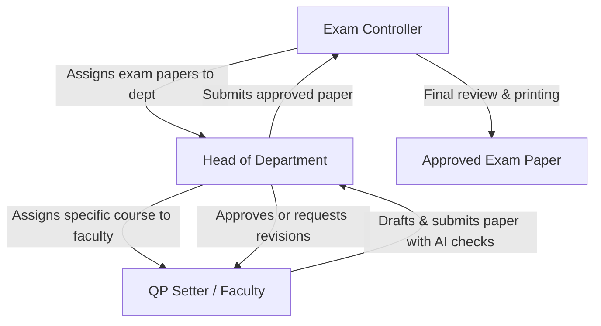

# AMCEC QPSet Memory

This document serves as the permanent brain and engineering memory for the **AMCEC QPSet** system. It provides a comprehensive mental model, architectural insights, and structural mappings for developers and architects.

---

## 1. Project Overview & Business Purpose

### 1.1 The Business Problem
In academic institutions (specifically AMC Engineering College - AMCEC), the preparation, validation, and management of examination question papers is a complex process. Historically, it suffers from:
*   **Quality Variations**: Difficulty matching university guidelines (e.g., VTU's target Bloom's Taxonomy percentages: 35% Easy, 40% Medium, 25% Hard).
*   **Repetition**: Accidental duplication of questions from previous cycles or syllabus imbalances.
*   **Approval Friction**: Long feedback loops between Exam Controllers, Heads of Departments (HODs), and Faculty (Question Paper Setters).
*   **Security Hazards**: Weak transport of physical or raw digital exam documents before the official test date.

### 1.2 The Solution
**AMCEC QPSet** is an automated, web-based platform with two primary components:
1.  **A React Frontend**: A shadcn/ui-styled client offering interactive dashboards, an AI-assisted paper creator, validation indicators (Bloom's Taxonomy distribution, Course Outcome mapping), and visual status tracking.
2.  **A TypeScript/Express Backend**: A versioned REST API (`/api/v1`) backed by PostgreSQL via Prisma ORM, handling authorization guards, notification feeds, course registries, syllabus schemes, and persistent session/audit logs.

---

## 2. Tech Stack

### 2.1 Frontend Client
*   **Framework**: React 18 with Vite (SWC compiler).
*   **Styling**: Tailwind CSS & `shadcn/ui` components (built on Radix UI primitives).
*   **Icons**: Lucide React.
*   **Routing**: React Router DOM (v6).
*   **State Management**: React Context (`AuthContext` for login/session state, `AppContext` for core entity states).
*   **Client Queries**: React Query (TanStack Query v5) is set up in `App.tsx` but currently unused as data is loaded/mocked via the context.

### 2.2 Backend Service
*   **Runtime**: Node.js (>=20.0.0) with TypeScript.
*   **Framework**: Express with versioned REST structure under `/api/v1`.
*   **Database ORM**: Prisma Client.
*   **Security & Encryption**: Helmet (security headers), bcryptjs (password hashing), JWT (jsonwebtoken for Access/Refresh tokens).
*   **Logging**: Pino & Pino-HTTP (JSON format logging).
*   **Metrics**: Prometheus (`prom-client`) reporting on `/health/metrics`.
*   **Validation**: Zod (type-safe request body and query validations).
*   **Documentation**: OpenAPI (Swagger UI) served at `/docs`.

### 2.3 Database
*   **Engine**: PostgreSQL (v16).
*   **Migrations**: Managed natively by Prisma.

### 2.4 Infrastructure & CI/CD
*   **Containers**: Docker & Docker Compose.
*   **CI/CD Pipeline**: GitHub Actions (`backend-ci.yml`) runs linting, DB migrations, builds, and executes unit tests inside a Docker container.

---

## 3. Repository Structure

```
amcec-qpset-main/
├── .agents/                    # Custom agent instructions and skills
├── .github/
│   └── workflows/
│       └── backend-ci.yml      # CI/CD workflow for the backend
├── amcec-qpset-main/           # Frontend Application
│   ├── public/                 # Static assets
│   ├── src/
│   │   ├── assets/             # Brand logos and images
│   │   ├── components/         # Shared components (badges, navigation, loaders)
│   │   │   └── ui/             # shadcn reusable primitives
│   │   ├── contexts/           # AppState & AuthContext (current mock data engine)
│   │   ├── data/
│   │   │   └── mockData.ts     # Frontend seeds and TypeScript interfaces
│   │   ├── hooks/              # Toast, responsive, and custom React hooks
│   │   ├── layouts/            # Role-specific dashboard layouts (Controller, HOD, Faculty)
│   │   ├── lib/                # Word document generators and styling utilities
│   │   ├── pages/              # Main page views segmented by roles
│   │   │   ├── controller/     # Exam Controller views
│   │   │   ├── hod/            # Head of Department views
│   │   │   ├── faculty/        # QP Setter views
│   │   │   ├── LoginPage.tsx
│   │   │   └── StartPage.tsx
│   │   ├── test/               # Vitest environment configurations
│   │   ├── App.tsx             # Route definitions and global Providers
│   │   └── main.tsx            # DOM mounting
│   ├── package.json
│   ├── tailwind.config.ts
│   └── tsconfig.json
└── backend/                    # Backend Application
    ├── prisma/
    │   ├── schema.prisma       # Database design definitions
    │   └── seed.ts             # Database seeder script
    ├── src/
    │   ├── config/             # Environment schemas and logger configurations
    │   ├── middleware/         # JWT parsing, errors, rate limiting, validation
    │   ├── observability/      # Prometheus collector and route timing handler
    │   ├── routes/             # REST endpoints (auth, assignments, schemes, etc.)
    │   ├── utils/              # Helper utilities
    │   ├── app.ts              # Express app setup and middleware configuration
    │   ├── db.ts               # Prisma database client instance
    │   └── server.ts           # Server start & shutdown handling
    ├── tests/
    │   └── health.test.ts      # Integration test for liveness endpoint
    ├── Dockerfile
    ├── docker-compose.yml
    └── package.json
```

Detailed breakdowns of this structure can be found in [architecture.md](file:///c:/Users/DHANUSH%20A%20G/Downloads/amcec-qpset-main/architecture.md).

---

## 4. Key Workflows & Roles

The system is designed around three key academic roles, each with specialized dashboards and actions:



### 4.1 Exam Controller (Dr. Nandishwar)
*   **Core Responsibilities**: Initiates exam cycles, registers department coordinators (HODs), monitors departmental paper status, reviews submitted papers, and pulls analytics reports.
*   **Workflow**:
    1.  Logs in to `/controller/dashboard`.
    2.  Creates an **Assignment** (exam task) targeting a specific course, semester, and due date, linking it to a department HOD via `/controller/assign`.
    3.  Monitors overall status of all papers.
    4.  Downloads final question papers as Word documents for physical print and distribution.

### 4.2 Head of Department & Coordinator (Dr. Meena Sharma - CSE AI&ML)
*   **Core Responsibilities**: Registers courses, manages departmental syllabus schemes, registers faculty members (QP Setters), assigns incoming papers to specific teachers, and acts as the first tier of quality approval.
*   **Workflow**:
    1.  Logs in to `/hod/dashboard` and registers any missing courses.
    2.  Creates a **Scheme** mapping out how many marks, parts, and Bloom's levels are expected per question for each test type.
    3.  Receives an assignment from the Controller, selects a faculty member, and delegates it.
    4.  Reviews submitted papers. Can write **Suggestions** (revision requests) or sign off with an approval.

### 4.3 QP Setter / Faculty (Prof. Swati)
*   **Core Responsibilities**: Compiles the question paper structure based on the Course syllabus, maps questions to Course Outcomes (COs) and Bloom's levels, and uses AI modules to refine questions.
*   **Workflow**:
    1.  Accesses `/faculty/dashboard` to see current tasks.
    2.  Enters the Question Paper Editor (`/faculty/create-paper`).
    3.  Leverages AI tools: "Auto-Balance" to distribute difficulty, "Repetition Check" to compare against previous cycles, and "Syllabus Check" to check coverage.
    4.  Submits the paper. If a revision is requested, reviews feedback, alters the questions, and submits again.

---

## 5. System Architecture & Routing Mappings

A brief summary of routing and endpoints is listed below:

### 5.1 Frontend Routes
All frontend routes are declared in [App.tsx](file:///c:/Users/DHANUSH%20A%20G/Downloads/amcec-qpset-main/amcec-qpset-main/src/App.tsx) and guarded by the custom `<ProtectedRoute>` component which checks session status and role membership.

For a full index of layout structures, middlewares, and layouts, see [routes.md](file:///c:/Users/DHANUSH%20A%20G/Downloads/amcec-qpset-main/routes.md).

### 5.2 API Routes
The backend API is versioned under `/api/v1` and expects Bearer JWT headers for all routes except `/api/v1/auth/login`.

For a full list of requests, payloads, response formats, and endpoint logic, see [api-map.md](file:///c:/Users/DHANUSH%20A%20G/Downloads/amcec-qpset-main/api-map.md).

---

## 6. Database Schema & Entity Relationships

The relational design of PostgreSQL is mapped via Prisma in [schema.prisma](file:///c:/Users/DHANUSH%20A%20G/Downloads/amcec-qpset-main/backend/prisma/schema.prisma). It maps:
*   **User**: Details academic roles (controller, hod, qpsetter) and links them to HOD hierarchies.
*   **Course**: Represents course metadata, credit weight, and associated departments.
*   **Scheme & SchemeRow**: Sets standard blueprints for exams.
*   **Assignment**: Tracks exam task deadlines, statuses, and links to final output papers.
*   **QuestionPaper**: Contains final structured questions stored as a raw JSON blob.
*   **Suggestion**: Revision comment feed.
*   **Notification**: Event notification logs.

For detailed table schemas, data types, constraints, and relational mappings, refer to [database-map.md](file:///c:/Users/DHANUSH%20A%20G/Downloads/amcec-qpset-main/database-map.md).

---

## 7. Current Technical Debt, Risks & Roadmap v2.0

A comprehensive technical audit has been performed on the codebase, resulting in the creation of the **[improvements2.0.md](file:///c:/Users/DHANUSH%20A%20G/Downloads/amcec-qpset-main/improvements2.0.md)** roadmap. The roadmap scopes out critical resolutions for the following project debt:

1.  **Security & Access Control (IDOR, CSRF, Token Rotation):** Implementing request ownership guards on routes in [assignments.routes.ts](file:///c:/Users/DHANUSH%20A%20G/Downloads/amcec-qpset-main/backend/src/routes/assignments.routes.ts), adding Double-Submit Cookie CSRF protection, and implementing Refresh Token Rotation with token family reuse tracking.
2.  **Audit Logging & Immutability:** Integrating append-only database audit logs and snapshotting approved question papers to prevent silent modifications post-approval.
3.  **Dynamic Schemas & Lexical Duplication Checks:** Implementing dynamically built Zod schemas for flexible exam types and using PostgreSQL `pg_trgm` (trigrams) for local duplication checking to prevent leaking draft questions to external APIs.
4.  **Frontend Binding & Offline Auto-Save:** Binding the question paper editor in [CreatePaper.tsx](file:///c:/Users/DHANUSH%20A%20G/Downloads/amcec-qpset-main/amcec-qpset-main/src/pages/faculty/CreatePaper.tsx) to backend endpoints and setting up IndexedDB auto-saves.
5.  **Malware Scanning & DR Strategy:** Utilizing ClamAV scanner for file uploads, establishing nightly logical backups, and setting up pre-migration snapshots.
6.  **DPDP Act, 2023 Scoping:** Preparing retention policies and erasure paths for faculty personal data.

For a detailed implementation breakdown, see **[improvements2.0.md](file:///c:/Users/DHANUSH%20A%20G/Downloads/amcec-qpset-main/improvements2.0.md)**. For the file import structure, see **[dependency-graph.md](file:///c:/Users/DHANUSH%20A%20G/Downloads/amcec-qpset-main/dependency-graph.md)**.

---
